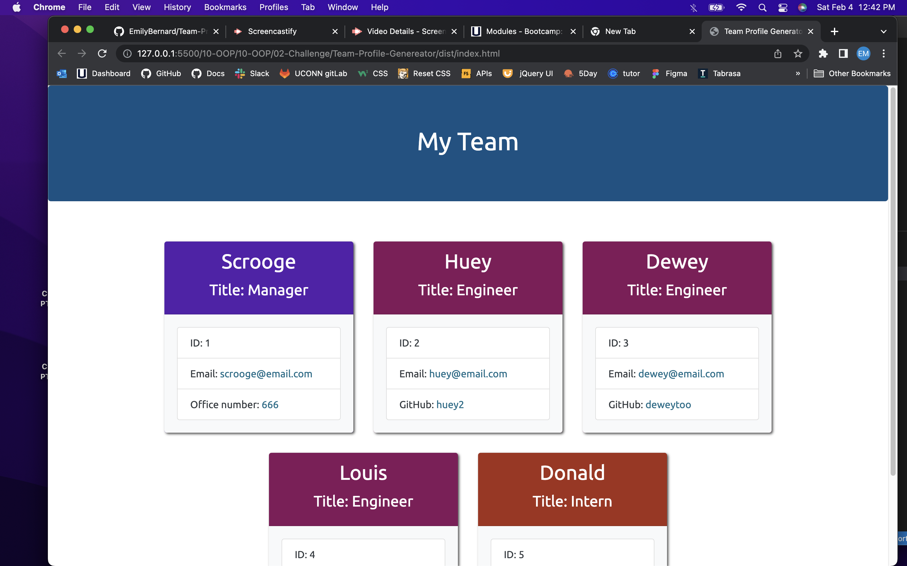

# Team-Profile-Genereator
A team profile generator that requires user input to create an HTML file.
 
 
# Project Status
Submitted for evaluation.
 
 
# Project Links

 https://github.com/EmilyBernard/Team-Profile-Genereator
 https://drive.google.com/file/d/1qwjI0GBrU13OASgB5Db8A-Vg8NiUJPv6/view

 
 
# Screenshots

 
 
 

# Table of Contents

  * [Technologies Used](#technologies-used)

  * [Usage](#usage)
  
  * [User Story](#user-story)

  * [Challenges](#challenges)

  * [Acknowledgements](#acknowledgements)
 
 

# Technologies Used
<ul>
<li>Used HTML, JavaScript, CSS, and Node to build the website.
<li>Used Screencastify to record the walkthrough video.
</ul>
 
 

# Usage
Users can run 'npm test' to see the tests passing or failing.
Users can run 'node index.js' to begin creating their team profile.
 
 

# User Story
<ul>
<li>As a user I want to create a team profile quickly
<li>WHEN I run 'node index.js' I will be asked a series of questions about the team manager.
<li>THEN I will be able to navigate to answer questions about team engineers or interns.
<li>WHEN I have finished answering all the questions,
<li>THEN I can navigte to 'End Application'.
<li>WHEN I choose to end the application,
<li>THEN an index.html file will be created in the /dist file.
<li>WHEN I open the HTML file in the browser,
<li>THEN I will see a Team Profile page with my team's information correctly organized.
</ul>
 
 

# Challenges
<ul>
<li>Running the tests produced fails for some files, which is actually a good thing because it pointed out issues that needed to be debugged. 
</ul>
 
 

# Acknowledgements
Thanks to:
<ul>
<li>Tutors and Ask BCS for their help in troubleshooting different issues.
</ul>